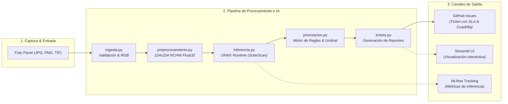

# SolarGuard AI — Auditoría Visual y Priorización de Mantenimiento Fotovoltaico con IA

[](https://www.python.org/)
[](https://docs.astral.sh/uv/)
[](https://astral.sh/ruff)
[](https://pytest.org/)
[](https://huggingface.co/SaifElgalaly/solarscan-yolov8n-cls)
[](https://onnxruntime.ai/)
[](.github/workflows/ci.yml)
[](LICENSE)

> **Prototipo Integral de Inteligencia Artificial para Detección de Anomalías Superficiales y Triaje Automatizado de Mantenimiento en Granjas Fotovoltaicas.**
> *Proyecto desarrollado en la Especialización en Inteligencia Artificial — Universidad Autónoma de Occidente (UAO).*

---

## 📑 Tabla de Contenidos

1. [Visión y Justificación del Negocio](#1-visión-y-justificación-del-negocio)
2. [Arquitectura del Sistema y Pipeline E2E](#2-arquitectura-del-sistema-y-pipeline-e2e)
3. [Modelo de IA y Catálogo de Diagnósticos](#3-modelo-de-ia-y-catálogo-de-diagnósticos)
4. [Matriz de Triaje, SLAs y Responsables](#4-matriz-de-triaje-slas-y-responsables)
5. [Guía de Inicio Rápido (Paso a Paso)](#5-guía-de-inicio-rápido-paso-a-paso)
6. [Automatización con Makefile](#6-automatización-con-makefile)
7. [Guía de Uso del Pipeline en Código](#7-guía-de-uso-del-pipeline-en-código)
8. [Alineación con la Rúbrica Académica (Módulo 3)](#8-alineación-con-la-rúbrica-académica-módulo-3)
9. [Estructura del Repositorio](#9-estructura-del-repositorio)
10. [Seguridad y Uso Responsable](#10-seguridad-y-uso-responsable)
11. [Equipo de Desarrollo](#11-equipo-de-desarrollo)

---

## 1. Visión y Justificación del Negocio

El mantenimiento manual de granjas fotovoltaicas es intensivo en mano de obra, costoso y propenso a errores humanos. La acumulación inadvertida de suciedad (polvo, deposiciones de aves) genera **puntos calientes (hotspots)** que reducen el rendimiento energético hasta un 25% y pueden derivar en degradación permanente de celdas o fallas de aislamiento eléctrico.

**SolarGuard AI** automatiza el ciclo de inspección visual:
- **Ingiere** fotografías tomadas por drones, técnicos en campo o cámaras fijas.
- **Normaliza y preprocesa** tensores de convolución de forma determinista.
- **Clasifica** la condición física del módulo mediante el clasificador `solarscan-yolov8n-cls` (ONNX Runtime).
- **Aplica reglas operativas de priorización** (`high`, `medium`, `low`) con umbrales configurables.
- **Dispara automáticamente tickets de soporte técnico** estructurados en GitHub Issues asignados a cuadrillas especializadas con sus respectivos SLAs.

---

## 2. Arquitectura del Sistema y Pipeline E2E

El proyecto sigue una estricta separación de responsabilidades con **alta cohesión y bajo acoplamiento** (detallada en el modelo interactivo de [Archify `docs/arquitectura.html`](docs/arquitectura.html) y en [`docs/arquitectura.md`](docs/arquitectura.md)):



### Contratos de Datos Clave
- **`LoadedImage`**: Imagen validada en RGB, con tamaño y formato verificado.
- **`FloatTensor (1, 3, 224, 224)`**: Tensor normalizado `0..1` en orden `NCHW`.
- **`PredictionResult`**: Clase predicha, nivel de confianza y probabilidades por clase.
- **`PriorityResult`**: Nivel operativo (`high`, `medium`, `low`), acción correctiva, justificación y bandera de revisión humana.
- **`MaintenanceTicket`**: Ticket inmutable estructurado con título, cuerpo Markdown, etiquetas y técnicos asignados.

---

## 3. Modelo de IA y Catálogo de Diagnósticos

El sistema utiliza `solarscan-yolov8n-cls`, un clasificador basado en YOLOv8 Nano exportado a ONNX por Saif Elgalaly en [Hugging Face Hub](https://huggingface.co/SaifElgalaly/solarscan-yolov8n-cls).

| Clase | Severidad Base | Acción Operativa Inmediata | Impacto Fotovoltaico |
| :--- | :---: | :--- | :--- |
| **`Electrical-damage`** | **Alta (`high`)** | Priorizar revisión técnica de string / caja de conexiones. | Riesgo crítico de arco eléctrico y pérdida de generación. |
| **`Physical-Damage`** | **Alta (`high`)** | Priorizar inspección mecánica; evaluar grietas o rotura. | Riesgo de infiltración de humedad y delaminación. |
| **`Dusty`** | **Media (`medium`)** | Programar limpieza con agua desmineralizada. | Pérdida de irradiancia solar por soiling continuo. |
| **`Bird-drop`** | **Media (`medium`)** | Programar limpieza focalizada urgente. | Formación acelerada de puntos calientes (hotspots). |
| **`Snow-Covered`** | **Media (`medium`)** | Programar remoción mecánica con herramienta blanda. | Bloqueo total de generación y sobrepeso en estructura. |
| **`Clean`** | **Baja (`low`)** | Ninguna intervención inmediata requerida. | Estado óptimo de operación nominal. |
| **`Unknown`** | **Media (`medium`)** | Requiere revisión humana o nueva captura. | Incertidumbre del modelo (confianza < 0.50). |

> [!NOTE]
> **Umbral Operativo de Revisión Humana:** Predicciones con confianza inferior al umbral configurable (`0.70` por defecto en `config/prioritization.toml`) activan la bandera `requires_human_review = True`, protegiendo la operación frente a clasificaciones dudosas.

---

## 4. Matriz de Triaje, SLAs y Responsables

Para transformar la IA en valor operativo de campo, SolarGuard AI asigna automáticamente cuadrillas técnicas y tiempos de respuesta (SLA):

| Severidad | Diagnóstico | Asignado | SLA Operativo | Etiquetas en GitHub |
| :---: | :--- | :--- | :---: | :--- |
| 🔴 **Alta** | `Electrical-damage` | `@ing-electrico` | `< 4 horas` | `maintenance`, `urgent`, `severity:high`, `electrical`, `risk` |
| 🔴 **Alta** | `Physical-Damage` | `@tecnico-campo` | `< 8 horas` | `maintenance`, `urgent`, `severity:high`, `structural`, `hardware` |
| 🟡 **Media** | `Dusty` | `@mantenimiento-limpieza` | `< 48 horas` | `maintenance`, `severity:medium`, `cleaning`, `preventive` |
| 🟡 **Media** | `Bird-drop` | `@mantenimiento-limpieza` | `< 24 horas` | `maintenance`, `severity:medium`, `cleaning`, `biological` |
| 🟡 **Media** | `Snow-Covered` | `@mantenimiento-limpieza` | `< 12 horas` | `maintenance`, `severity:medium`, `cleaning`, `weather` |
| 🟡 **Media** | `Unknown` | `@supervisor-triaje` | `< 12 horas` | `maintenance`, `severity:medium`, `triaje`, `requires-human-review` |
| 🟢 **Baja** | `Clean` | *(Sin asignación)* | N/A | `routine` (No genera ticket salvo `--force`) |

---

## 5. Guía de Inicio Rápido (Paso a Paso)

### 5.1. Requisitos del Sistema
- **Python:** `3.13` (versión estricta del proyecto).
- **Gestor de Paquetes:** [Astral `uv`](https://docs.astral.sh/uv/) (está prohibido el uso de `pip`).
- **Sistema Operativo:** Windows 10/11, macOS o Linux.
- **Herramienta opcional:** `make` (GNU Make).

### 5.2. Instalación y Puesta a Punto

1. **Clonar el repositorio:**
   ```bash
   git clone https://github.com/karolldahian/solarguard-ai.git
   cd solarguard-ai
   ```

2. **Sincronizar el entorno virtual con `uv`:**
   ```bash
   uv sync
   # O alternativamente con Make:
   make install
   ```

3. **Verificar el estado del entorno y componentes:**
   ```bash
   make status
   ```

4. **Ejecutar la suite completa de pruebas:**
   ```bash
   make test
   ```

5. **(Opcional) Descargar los pesos ONNX del modelo:**
   Para inferencia con pesos reales, descargue `best.onnx` desde [Hugging Face](https://huggingface.co/SaifElgalaly/solarscan-yolov8n-cls) y ubíquelo en la carpeta local `models/best.onnx`.

---

## 6. Automatización con Makefile

El proyecto cuenta con un `Makefile` estandarizado para maximizar la productividad y garantizar la calidad del código:

| Comando | Categoría | Descripción |
| :--- | :---: | :--- |
| `make help` | Ayuda | Muestra el menú de comandos disponibles con sus descripciones. |
| `make status` | Diagnóstico | Ejecuta el reporte del entorno, módulos y dependencias. |
| `make test` | Calidad | Corre las **139 pruebas unitarias** con Pytest en modo detallado (`-v`). |
| `make check` | Calidad | Ejecuta validación de linters (`ruff check`), formato y `uv lock --check`. |
| `make format` | Calidad | Aplica corrección automática de estilos y formato con Ruff. |
| `make gga` | Calidad | Ejecuta auditoría de arquitectura con Gentleman Guardian Angel. |
| `make gga-pr` | Calidad | Audita el Pull Request actual contra `main` usando GGA con OpenCode. |
| `make pre-commit` | Calidad | Ejecuta la suite completa de hooks de pre-commit sobre todos los archivos. |
| `make pre-commit-install` | Entorno | Instala y vincula los hooks de Git para pre-commit y GGA. |
| `make compile` | Calidad | Verifica la compilación sintáctica de todos los módulos Python. |
| `make install` | Entorno | Sincroniza dependencias del proyecto usando `uv sync`. |
| `make streamlit`| Pipeline | Inicia la interfaz web en Streamlit (cuando esté lista en `main`). |
| `make backend`  | Pipeline | Inicia el servidor de backend gRPC (cuando esté disponible). |
| `make clean`    | Mantenimiento | Elimina cachés locales (`__pycache__`, `.pytest_cache`, `.ruff_cache`). |

---

## 7. Guía de Uso del Pipeline en Código

### 7.1. Ingesta y Preprocesamiento de una Imagen
```python
from pathlib import Path
from solarguard_ai.ingesta import load_image
from solarguard_ai.preprocesamiento import preprocess_for_solarscan

# 1. Cargar y validar imagen RGB (JPG, PNG o TIF)
loaded = load_image("data/muestra_panel.jpg")
print(f"Dimensiones originales: {loaded.size}, Formato: {loaded.format}")

# 2. Convertir a tensor NCHW (1, 3, 224, 224) normalizado 0..1
tensor = preprocess_for_solarscan(loaded.image)
print(f"Tensor listo para ONNX: {tensor.shape}, Dtype: {tensor.dtype}")
```

### 7.2. Inferencia y Reglas de Priorización
```python
from solarguard_ai.inferencia import SolarScanInference
from solarguard_ai.priorizacion import load_priority_config, prioritize

# Inferencia ONNX
service = SolarScanInference("models/best.onnx")
prediction = service.predict(tensor)
print(f"Predicción: {prediction.predicted_class} ({prediction.confidence:.2%})")

# Priorización con umbral operativo configurable
config = load_priority_config("config/prioritization.toml")
priority = prioritize(
    predicted_class=prediction.predicted_class,
    confidence=prediction.confidence,
    review_threshold=config.review_confidence,
)
print(f"Severidad: {priority.priority.upper()} | Acción: {priority.recommended_action}")
```

### 7.3. Generación Automática del Ticket de Mantenimiento
```python
from solarguard_ai.tickets import generate_maintenance_ticket

# Emisión de ticket (modo simulación dry-run por defecto)
ticket_result = generate_maintenance_ticket(
    priority_result=priority,
    panel_id="PANEL-STRING-04",
    predicted_class=prediction.predicted_class,
    confidence=prediction.confidence,
    location="Granja Solar Yumbo - Bloque 2",
)

if ticket_result.status in {"created", "simulated"}:
    print(f"Ticket generado exitosamente: Issue #{ticket_result.issue_number}")
    print(f"URL: {ticket_result.issue_url}")
```

---

## 8. Alineación con la Rúbrica Académica (Módulo 3)

SolarGuard AI cumple rigurosamente con los criterios de evaluación del **Módulo 3: Aplicación Completa (25% de la nota final)**:

```
┌────────────────────────────────────────────────────────────────────────┐
│             RÚBRICA DE EVALUACIÓN MÓDULO 3 (VALOR TOTAL: 25%)          │
├──────────────────────┬───────┬─────────────────────────────────────────┤
│ Criterio             │  Peso │ Cumplimiento en SolarGuard AI           │
├──────────────────────┼───────┼─────────────────────────────────────────┤
│ 1. Demo E2E          │  25%  │ Pipeline continuo: Ingesta ➔ Preproceso ➔│
│                      │       │ Inferencia ➔ Priorización ➔ Tickets.    │
│ 2. MLflow Tracking   │  20%  │ Logging de latencias, confianza y clases│
│                      │       │ de inferencia en servidor local MLflow. │
│ 3. Kanban Ágil       │  15%  │ Tablero de proyecto con estimaciones    │
│                      │       │ Fibonacci, roles y ruta crítica (Gantt).│
│ 4. Backend           │  15%  │ Servidor desacoplado (gRPC / FastAPI)   │
│                      │       │ documentado en docs/arquitectura.md.    │
│ 5. QA & GitFlow      │  15%  │ 139 tests (AAA), Ruff, CI/CD en GitHub  │
│                      │       │ Actions y Conventional Commits.         │
│ 6. Sustentación & MC │  10%  │ Model Card formal y diapositivas de     │
│                      │       │ defensa técnica del prototipo.          │
└──────────────────────┴───────┴─────────────────────────────────────────┘
```

---

## 9. Estructura del Repositorio

```text
solarguard-ai/
├── Dockerfile                         # Contenedorización de la aplicación completa
├── .github/
│   └── workflows/
│       └── ci.yml                     # Pipeline de integración continua (GitHub Actions)
├── config/
│   └── prioritization.toml            # Configuración de umbrales operativos de revisión
├── docs/
│   └── arquitectura.md                # Diagramas C4, contratos y especificación OpenAPI
├── scripts/
│   └── status.py                      # Diagnóstico del entorno y reporte de componentes
├── src/
│   └── solarguard_ai/
│       ├── __init__.py                # Entrypoint del paquete
│       ├── ingesta.py                 # Validación y carga de imágenes RGB
│       ├── preprocesamiento.py        # Normalización y tensores para SolarScan
│       ├── inferencia.py              # Servicio ONNX Runtime y caché de tensores
│       ├── priorizacion.py            # Motor de reglas y prioridades operativas
│       └── tickets.py                 # Generación y despacho de tickets en GitHub Issues
├── tests/
│   ├── test_ingesta.py                # Pruebas de validación de archivos e imágenes
│   ├── test_preprocesamiento.py       # Pruebas de recorte, canales y dimensiones
│   ├── test_inferencia.py             # Pruebas de sesiones ONNX, logits y caché
│   ├── test_priorizacion.py           # Pruebas de matriz de severidad y umbrales
│   └── test_tickets.py                # Pruebas de formato, asignación y cliente GitHub
├── .python-version                    # Definición estricta de Python 3.13
├── Makefile                           # Automatización categorizada de tareas
├── README.md                          # Documentación maestra del proyecto
├── pyproject.toml                     # Definición de dependencias con Astral UV
└── uv.lock                            # Archivo de bloqueo reproducible
```

---

## 10. Seguridad y Uso Responsable

- **No Diagnóstico Definitivo:** Las clasificaciones emitidas por SolarGuard AI corresponden a una auditoría visual preliminar y no sustituyen una prueba eléctrica de curvas I-V ni mediciones de aislamiento con megóhmetro.
- **Seguridad Eléctrica:** Antes de intervenir cualquier panel reportado con `Electrical-damage`, la cuadrilla técnica debe aislar el string correspondiente, verificar ausencia de tensión y utilizar EPP dieléctrico clase 0.
- **Gestión Segura de Secretos:** El repositorio prohíbe el rastreo de tokens de acceso (`GITHUB_TOKEN`), credenciales cloud o archivos `.env`.

---

## 11. Equipo de Desarrollo

Proyecto académico desarrollado en la **Especialización en Inteligencia Artificial** de la **Universidad Autónoma de Occidente (UAO)**:

- **Jose Fernando Luque Cajiao** — *Arquitectura de Software, Motor de Priorización y Tickets de Soporte.*
- **Julio Cesar Rosero Porras** — *Validación de Modelos, Preprocesamiento e Inferencia ONNX.*
- **Karoll Dahian Ramirez Marulanda** — *Ingesta de Datos, Definición Funcional y Frontend Reactivo (Streamlit).*
- **Jarvin David Alvarado Garces** — *Configuración UV, Integración Backend (gRPC) y MLflow Tracking.*

---

## 12. Licencia

Este software se distribuye bajo los términos de la licencia [MIT](LICENSE).
