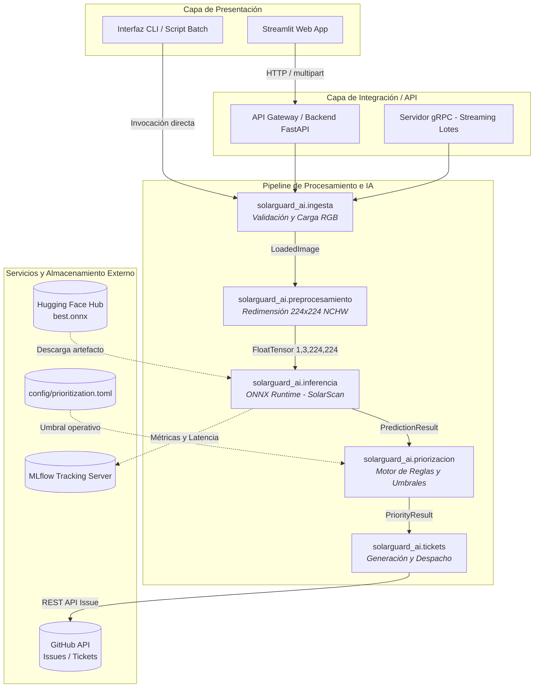
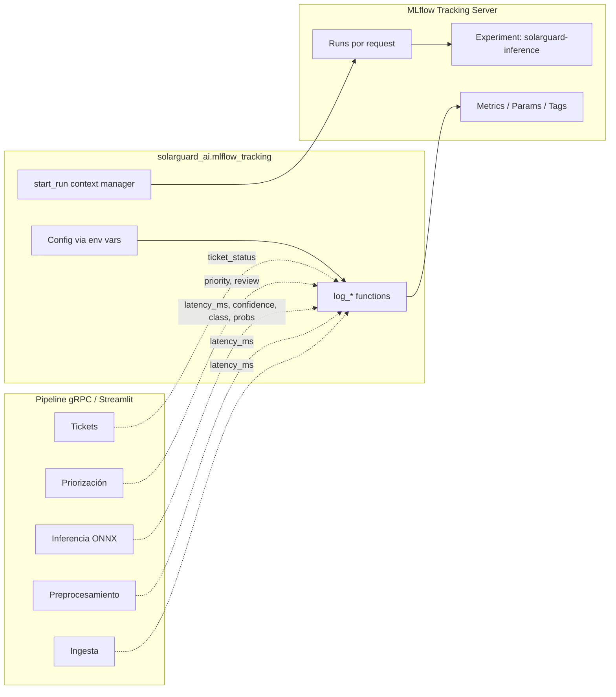

# SolarGuard AI — Arquitectura del Sistema y Contratos de Integración

> **Documento de Arquitectura y Especificación Técnica (Issue #4)**
> **Proyecto:** SolarGuard AI — Detección y Priorización de Mantenimiento en Paneles Fotovoltaicos con IA
> **Especialización en Inteligencia Artificial — Universidad Autónoma de Occidente (UAO)**
> **Autor / Arquitecto:** Jose Fernando Luque Cajiao

---

## 1. Visión General y Principios de Diseño

SolarGuard AI es una plataforma modular y desacoplada concebida para la auditoría visual automatizada de módulos solares fotovoltaicos. Su propósito es clasificar el estado físico-superficial del panel, calcular la prioridad operativa de atención y generar de manera desatendida los tickets de mantenimiento para las cuadrillas técnicas.

### Principios Fundamentales (AGENTS.md):
1. **Alta Cohesión y Bajo Acoplamiento:** Cada módulo (`ingesta`, `preprocesamiento`, `inferencia`, `priorizacion`, `tickets`, `view`) posee una responsabilidad única y aislada.
2. **Independencia Tecnológica de la Lógica de Negocio:** El motor de reglas de priorización y el emisor de tickets no dependen de ONNX Runtime, TensorFlow ni librerías de visión por computador.
3. **No Diagnóstico Eléctrico Definitivo:** Toda inferencia visual es una alerta preliminar sujeta a verificación de personal técnico calificado.
4. **Resiliencia y Modo Degradado:** Los servicios permiten ejecución simulada (*dry-run*) y manejo controlado de fallos sin interrumpir la operación.

---

## 2. Diagrama de Arquitectura del Sistema



---

## 3. Contratos de Datos Entre Módulos Internos

Cada capa del pipeline consume y entrega contratos inmutables basados en `dataclasses` tipadas con Type Hints estrictos (PEP 484):

### 3.1. Ingesta (`solarguard_ai.ingesta`)
- **Entrada:** `source: str | Path | BinaryIO` (JPEG, PNG, TIFF).
- **Salida:** `LoadedImage`
  ```python
  @dataclass(frozen=True)
  class LoadedImage:
      image: Image.Image  # Imagen en modo RGB
      format: str  # Formato de origen ('JPEG', 'PNG', etc.)
      size: tuple[int, int]  # Dimensiones originales (width, height)
  ```

### 3.2. Preprocesamiento (`solarguard_ai.preprocesamiento`)
- **Entrada:** `image: Image.Image | NDArray[np.generic]`
- **Salida:** `FloatTensor` de tipo `np.float32` normalizado `0..1` con forma exacta `(1, 3, 224, 224)` en orden de canales `NCHW`.

### 3.3. Inferencia (`solarguard_ai.inferencia`)
- **Entrada:** `tensor: FloatTensor`
- **Salida:** `PredictionResult`
  ```python
  @dataclass(frozen=True)
  class PredictionResult:
      predicted_class: str  # Clean, Dusty, Bird-drop, Electrical-damage, etc.
      confidence: float  # 0.0 a 1.0
      probabilities: dict[str, float]  # Distribución completa de probabilidades
  ```

### 3.4. Priorización Operativa (`solarguard_ai.priorizacion`)
- **Entrada:** `predicted_class: str`, `confidence: float`, `review_threshold: float`
- **Salida:** `PriorityResult`
  ```python
  @dataclass(frozen=True)
  class PriorityResult:
      priority: PriorityLevel  # "high" | "medium" | "low"
      recommended_action: str  # Acción operativa inmediata
      requires_human_review: bool  # True si confidence < review_threshold o Unknown
      reason: str  # Justificación técnica de la prioridad
  ```

### 3.5. Generación de Tickets (`solarguard_ai.tickets`)
- **Entrada:** `priority_result: PriorityResult`, `panel_id: str`, `location: str`, `confidence: float`
- **Salida:** `MaintenanceTicket` y `TicketCreationResult`
  ```python
  @dataclass(frozen=True)
  class MaintenanceTicket:
      title: str  # Título estandarizado para triaje
      body: str  # Cuerpo estructurado en Markdown con alertas y descargos
      labels: list[str]  # ['maintenance', 'urgent', 'electrical', ...]
      assignees: list[str]  # ['ing-electrico', ...]
      severity: str  # 'high' | 'medium' | 'low'
      panel_id: str
      location: str
      predicted_class: str
      confidence: float
      requires_human_review: bool
      created_at: str  # ISO 8601 UTC


  @dataclass(frozen=True)
  class TicketCreationResult:
      status: str  # 'created' | 'simulated' | 'skipped' | 'failed'
      message: str
      ticket: MaintenanceTicket | None
      issue_number: int | None
      issue_url: str | None
  ```

---

## 4. Especificación OpenAPI 3.1.0 de Endpoints REST

La API del backend expone los siguientes endpoints para el frontend Streamlit y clientes externos:

```yaml
openapi: 3.1.0
info:
  title: SolarGuard AI REST API
  description: Servicio de inferencia, priorización y generación de tickets para mantenimiento fotovoltaico.
  version: 1.0.0
paths:
  /health:
    get:
      summary: Verificación de estado y salud del servicio
      responses:
        '200':
          description: Servicio saludable
          content:
            application/json:
              schema:
                type: object
                properties:
                  status: { type: string, example: "ok" }
                  model_loaded: { type: boolean, example: true }
                  version: { type: string, example: "0.1.0" }

  /api/v1/predict:
    post:
      summary: Clasificación visual de imagen de panel solar
      requestBody:
        required: true
        content:
          multipart/form-data:
            schema:
              type: object
              required: [file]
              properties:
                file:
                  type: string
                  format: binary
      responses:
        '200':
          description: Inferencia exitosa
          content:
            application/json:
              schema:
                $ref: '#/components/schemas/PredictionResponse'
        '400':
          $ref: '#/components/responses/400BadRequest'
        '415':
          $ref: '#/components/responses/415UnsupportedMedia'

  /api/v1/prioritize:
    post:
      summary: Evaluación de prioridad operativa de mantenimiento
      requestBody:
        required: true
        content:
          application/json:
            schema:
              type: object
              required: [predicted_class, confidence]
              properties:
                predicted_class: { type: string, example: "Electrical-damage" }
                confidence: { type: number, minimum: 0.0, maximum: 1.0, example: 0.94 }
                review_threshold: { type: number, example: 0.70 }
      responses:
        '200':
          content:
            application/json:
              schema:
                $ref: '#/components/schemas/PriorityResponse'

  /api/v1/tickets:
    post:
      summary: Emisión de ticket de mantenimiento en GitHub Issues
      requestBody:
        required: true
        content:
          application/json:
            schema:
              type: object
              required: [panel_id, predicted_class, confidence, priority]
              properties:
                panel_id: { type: string, example: "PANEL-B04-12" }
                location: { type: string, example: "Inversor 2 - Bloque Sur" }
                predicted_class: { type: string, example: "Electrical-damage" }
                confidence: { type: number, example: 0.94 }
                priority: { type: string, enum: [high, medium, low], example: "high" }
                force: { type: boolean, default: false }
      responses:
        '201':
          description: Ticket creado o simulado exitosamente
          content:
            application/json:
              schema:
                $ref: '#/components/schemas/TicketResponse'

  /api/v1/pipeline:
    post:
      summary: Pipeline integral de auditoría (Imagen -> Inferencia -> Prioridad -> Ticket)
      requestBody:
        required: true
        content:
          multipart/form-data:
            schema:
              type: object
              required: [file, panel_id]
              properties:
                file: { type: string, format: binary }
                panel_id: { type: string, example: "PANEL-B04-12" }
                location: { type: string, example: "Parque Solar Yumbo" }
                create_ticket: { type: boolean, default: true }
      responses:
        '200':
          content:
            application/json:
              schema:
                type: object
                properties:
                  prediction: { $ref: '#/components/schemas/PredictionResponse' }
                  priority: { $ref: '#/components/schemas/PriorityResponse' }
                  ticket: { $ref: '#/components/schemas/TicketResponse' }

components:
  schemas:
    PredictionResponse:
      type: object
      properties:
        predicted_class: { type: string, example: "Physical-Damage" }
        confidence: { type: number, example: 0.925 }
        probabilities:
          type: object
          additionalProperties: { type: number }

    PriorityResponse:
      type: object
      properties:
        priority: { type: string, enum: [high, medium, low] }
        recommended_action: { type: string }
        requires_human_review: { type: boolean }
        reason: { type: string }

    TicketResponse:
      type: object
      properties:
        status: { type: string, enum: [created, simulated, skipped, failed] }
        message: { type: string }
        issue_number: { type: integer, nullable: true }
        issue_url: { type: string, nullable: true }

  responses:
    400BadRequest:
      description: Solicitud inválida (parámetros faltantes o corruptos)
    415UnsupportedMedia:
      description: Formato de archivo no soportado (solo JPEG, PNG, TIFF)
    500InternalError:
      description: Error interno de inferencia o comunicación con GitHub
```

---

## 5. Códigos de Error HTTP y Excepciones del Dominio

| Código HTTP | Significado | Excepción Interna de Dominio | Causa Común |
| :--- | :--- | :--- | :--- |
| **`200 OK`** | Operación completada con éxito | Ninguna | Inferencia o priorización resuelta |
| **`201 Created`** | Recurso creado exitosamente | Ninguna | Issue de GitHub generado en el repositorio |
| **`400 Bad Request`** | Parámetros inválidos | `ValueError`, `PrioritizationError` | Confianza fuera de rango `[0, 1]`, clase no soportada |
| **`415 Unsupported Media`** | Tipo de archivo no permitido | `ImageIngestionError` | Archivo PDF, SVG, o extensión desconocida |
| **`422 Unprocessable`** | Archivo legible pero tensor inválido | `InferenceError` | Imagen vacía o dimensiones incompatibles |
| **`500 Internal Server Error`** | Falla interna del servicio | `TicketGenerationError` | Fallo de conexión con GitHub API o carga del modelo |
| **`503 Service Unavailable`** | Inferencia no disponible | `InferenceError` | Archivo `best.onnx` no encontrado en ruta local |

---

## 6. MLflow Tracking (Observabilidad de Inferencia)

### 6.1. Propósito
Registrar métricas operativas de cada inferencia para auditoría, análisis de rendimiento y debugging del modelo `solarscan-yolov8n-cls` en producción.

### 6.2. Arquitectura de Tracking



### 6.3. Métricas Registradas

| Métrica | Tipo | Origen | Descripción |
| :--- | :--- | :--- | :--- |
| `total_latency_ms` | metric | gRPC/Streamlit | Latencia end-to-end del request |
| `ingestion_latency_ms` | metric | gRPC | Tiempo de validación y carga de imagen |
| `preprocessing_latency_ms` | metric | gRPC | Tiempo de resize, crop, normalización |
| `inference_latency_ms` | metric | Inferencia | Tiempo de `session.run()` ONNX |
| `ticket_latency_ms` | metric | gRPC | Tiempo de generación de ticket GitHub |
| `confidence` | metric | Inferencia | Score de confianza (0.0–1.0) |
| `predicted_class` | tag | Inferencia | Clase: Clean, Dusty, Electrical-damage, etc. |
| `prob_<class>` | metric | Inferencia | Probabilidad por clase (softmax) |
| `cache_hit` | metric | Inferencia | 1.0 si vino de caché, 0.0 si inferencia fresca |
| `is_unknown` | metric | Inferencia | 1.0 si clase = Unknown |
| `requires_human_review` | metric | Priorización | 1.0 si confidence < threshold |
| `priority` | tag | Priorización | high / medium / low |
| `ticket_status` | tag | Tickets | created / simulated / skipped / failed |
| `error_count` | metric | Error handling | 1 por cada error capturado |
| `error_type` | tag | Error handling | IngestionError, InferenceError, etc. |

### 6.4. Configuración

**Variables de entorno:**
| Variable | Default | Descripción |
| :--- | :--- | :--- |
| `MLFLOW_TRACKING_URI` | `http://localhost:5000` | URI del servidor MLflow |
| `MLFLOW_EXPERIMENT` | `solarguard-inference` | Nombre del experimento |
| `MLFLOW_ENABLED` | `true` | Activar/desactivar tracking |

**Archivo:** `config/mlflow.toml`

### 6.5. API del Módulo (`src/solarguard_ai/mlflow_tracking.py`)

```python
from solarguard_ai.mlflow_tracking import (
    is_enabled,
    start_run,
    log_prediction,
    log_pipeline_request,
    log_streamlit_request,
    log_error,
)

# Verificar si tracking está activo
if is_enabled():
    with start_run(run_name="inference-001") as run:
        log_prediction(
            predicted_class="Electrical-damage",
            confidence=0.94,
            latency_ms=42.5,
            probabilities={"Electrical-damage": 0.94, ...},
            model_path="models/best.onnx",
            confidence_threshold=0.7,
            panel_id="PANEL-001",
        )

# En servidor gRPC (automático en ClasificarImagen)
log_pipeline_request(
    panel_id="PANEL-001",
    image_size=(640, 480),
    image_format="JPEG",
    total_latency_ms=150.0,
    ingestion_latency_ms=5.0,
    preprocessing_latency_ms=10.0,
    inference_latency_ms=45.0,
    ticket_latency_ms=20.0,
    predicted_class="Dusty",
    confidence=0.88,
    priority="medium",
    requires_human_review=False,
    ticket_status="created",
)

# En Streamlit (automático al clasificar)
log_streamlit_request(
    panel_id="panel_01.jpg",
    image_size=(800, 600),
    image_format="PNG",
    total_latency_ms=200.0,
    network_latency_ms=50.0,
    predicted_class="Bird-drop",
    confidence=0.75,
    priority="medium",
)
```

### 6.6. Comandos Make

| Comando | Descripción |
| :--- | :--- |
| `make mlflow-ui` | Inicia MLflow UI en `http://localhost:5000` |
| `make mlflow-clean` | Elimina directorio local `mlruns/` |

### 6.7. Modo Degradado
Si `MLFLOW_ENABLED=false` o el servidor MLflow no está disponible:
- Las funciones `log_*` y `start_run` hacen **no-op** (retornan inmediatamente)
- No se lanzan excepciones ni se bloquea el pipeline
- El comportamiento es transparente para el resto del sistema

---

## 7. Mapeo Organizacional y Reglas de Triaje

Para dar cumplimiento a la operación en campo y despacho a cuadrillas:

| Clase Diagnosticada | Nivel de Severidad | Responsable Asignado | SLA Operativo | Etiquetas GitHub |
| :--- | :--- | :--- | :--- | :--- |
| **`Electrical-damage`** | **Alta (`high`)** | `@ing-electrico` | `< 4 horas` | `maintenance`, `urgent`, `severity:high`, `electrical`, `risk` |
| **`Physical-Damage`** | **Alta (`high`)** | `@tecnico-campo` | `< 8 horas` | `maintenance`, `urgent`, `severity:high`, `structural`, `hardware` |
| **`Dusty`** | **Media (`medium`)** | `@mantenimiento-limpieza` | `< 48 horas` | `maintenance`, `severity:medium`, `cleaning`, `preventive` |
| **`Bird-drop`** | **Media (`medium`)** | `@mantenimiento-limpieza` | `< 24 horas` | `maintenance`, `severity:medium`, `cleaning`, `biological` |
| **`Snow-Covered`** | **Media (`medium`)** | `@mantenimiento-limpieza` | `< 12 horas` | `maintenance`, `severity:medium`, `cleaning`, `weather` |
| **`Unknown`** | **Media (`medium`)** | `@supervisor-triaje` | `< 12 horas` | `maintenance`, `severity:medium`, `triaje`, `review-needed`, `requires-human-review` |
| **`Clean`** | **Baja (`low`)** | *(Sin asignación)* | N/A | `routine` (No genera ticket automático) |

---

## 8. Verificación y Calidad

- **Pruebas Unitarias:** Cada contrato de datos cuenta con cobertura en `tests/test_ingesta.py`, `tests/test_preprocesamiento.py`, `tests/test_inferencia.py`, `tests/test_priorizacion.py`, `tests/test_tickets.py` y `tests/test_mlflow.py`.
- **Estructura AAA:** Las pruebas se rigen por Arrange-Act-Assert sin efectos colaterales de red ni dependencias de tokens en CI.
- **Herramientas de Calidad:** Validado bajo `ruff check` y `ruff format` conforme a Python 3.13.
